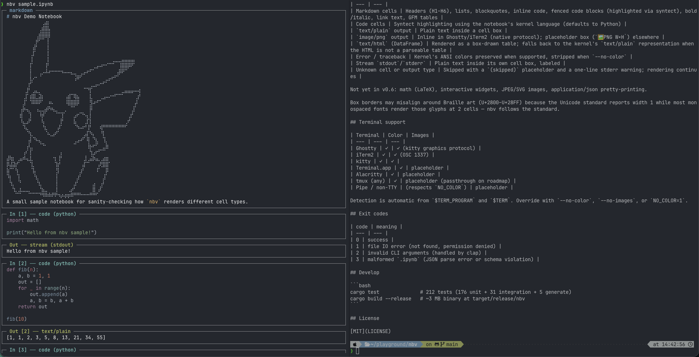

<p align="center">
  
</p>

<p align="center">
  <a href="https://crates.io/crates/nbv"></a>
  <a href="https://github.com/phd1000x-ux/nbv/releases"></a>
  <a href="LICENSE"></a>
</p>

<p align="center">
  <a href="README.md">English</a>
</p>

<p align="center">
  <b>노트북을 보겠다고 터미널을 떠나지 마세요.</b><br>
  서버도 브라우저도 없이, 원격 SSH에서든 PR에서든 즉시 읽는 터미널 네이티브 <code>.ipynb</code> 뷰어.
</p>

브라우저나 JupyterLab, VS Code를 띄우지 않고 `.ipynb` 파일을 터미널에서 그대로 본다. `cat`/`bat` 같은 흐름을 그대로 — 한 번 호출하면 stdout으로 전체 내용을 쏟아내고 끝.

## 데모

<p align="center">
  
</p>

```
$ nbv analysis.ipynb
┌─ markdown ───────────────────────────────────────────────┐
│ # Simple Notebook                                        │
│ A basic test.                                            │
└──────────────────────────────────────────────────────────┘
┌─ In [1] ── code (python) ────────────────────────────────┐
│ x = 1 + 2                                                │
└──────────────────────────────────────────────────────────┘
┌─ Out [1] ── text/plain ──────────────────────────────────┐
│ 3                                                        │
└──────────────────────────────────────────────────────────┘
```

Ghostty나 iTerm2에서는 matplotlib/seaborn으로 만든 PNG 출력이 셀 안에 인라인으로 그려진다.

레포지토리 클론 직후에 바로 돌려보고 싶다면 `nbv sample.ipynb`를 실행해보면 된다 — 5셀짜리 데모 노트북(마크다운 + stdout 있는 파이썬 코드)이 같이 들어 있다.

## 주요 기능

- **빠르다.** 셀 단위로 stdout flush — 200셀 노트북도 200ms 이내에 끝나고, 첫 셀은 ms 단위로 보인다.
- **단일 바이너리.** 약 3 MB. 런타임 의존성 없음. 파이썬 안 깔려도 됨.
- **이미지 인라인.** Ghostty와 iTerm2의 그래픽 프로토콜을 네이티브로 지원. 그 외 터미널에서는 PNG 크기를 표시하는 placeholder 박스로 폴백.
- **자동 감지.** TTY 여부, 터미널 종류, 컬러 지원 여부 — 환경변수 설정 없이 그냥 동작한다.
- **파이프 안전.** non-TTY 감지해서 우아하게 폴백. `nbv x.ipynb | less -R` 그대로 됨. `| head`로 끊겨도 `SIGPIPE`를 잡아서 exit 0.
- **시각적 마감.** Unicode box-drawing으로 그린 셀 경계, `syntect` 기반 코드 하이라이팅, 마크다운 헤더/리스트 정렬, 커널이 준 ANSI 색이 살아있는 traceback.
- **표 렌더링.** 마크다운 셀의 GFM 파이프 표와 pandas DataFrame `text/html` 출력을 컬럼 정렬이 살아있는 box-drawing 표로 렌더링.

## 설치

**Homebrew (macOS arm64):**

```bash
brew install phd1000x-ux/tap/nbv
```

**Cargo (Rust 1.70 이상이면 어디서나):**

```bash
cargo install nbv
```

> **Windows에서는?** 네이티브 Windows 빌드는 아직 지원하지 않지만, **WSL**(Windows Subsystem for Linux)에서는 수정 없이 그대로 돌아간다. WSL 배포판 안에 Rust를 설치한 뒤 위의 `cargo install nbv`를 그대로 실행하면 된다.

**Prebuilt 바이너리 (macOS arm64):**

```bash
TAG=$(curl -fsSL https://api.github.com/repos/phd1000x-ux/nbv/releases/latest \
  | sed -n 's/.*"tag_name": *"\([^"]*\)".*/\1/p')
curl -fL "https://github.com/phd1000x-ux/nbv/releases/download/$TAG/nbv-$TAG-aarch64-apple-darwin.tar.gz" \
  | tar -xz -C /usr/local/bin
```

**Prebuilt 바이너리 (Linux x86_64, static musl):**

```bash
TAG=$(curl -fsSL https://api.github.com/repos/phd1000x-ux/nbv/releases/latest \
  | sed -n 's/.*"tag_name": *"\([^"]*\)".*/\1/p')
curl -fL "https://github.com/phd1000x-ux/nbv/releases/download/$TAG/nbv-$TAG-x86_64-unknown-linux-musl.tar.gz" \
  | tar -xz -C /usr/local/bin
```

**소스에서 빌드:**

```bash
git clone https://github.com/phd1000x-ux/nbv.git
cd nbv
cargo install --path .
```

`cargo install` 후 `~/.cargo/bin`이 `PATH`에 없다는 경고가 뜨면:

```bash
~/.cargo/bin/nbv setup
```

(아직 `nbv`가 `PATH`에 없으니 풀패스로 호출 — 그게 바로 해결하려는 문제니까.) `setup`은 셸(zsh / bash / fish)을 감지해서 rc 파일에 추가할 한 줄을 보여주고 y/N로 확인받는다. 적용 후엔 현재 터미널에서 즉시 활성화할 수 있는 한 줄도 같이 출력해준다 — zsh/bash는 `export PATH=…`, fish는 `fish_add_path …`. 또는 새 터미널을 열어도 된다. 확인 프롬프트 건너뛰려면 `--yes`.

## 사용법

```bash
nbv analysis.ipynb                          # stdout으로 렌더링
nbv --no-color analysis.ipynb               # ANSI 색 끄기
nbv --no-images analysis.ipynb              # 이미지 강제 placeholder
nbv --theme InspiredGitHub analysis.ipynb   # 코드 블록의 syntect 테마 변경
nbv --list-themes                           # 사용 가능한 syntect 테마 이름 목록
nbv --width 120 analysis.ipynb              # 출력 폭 강제 (최소 20; 기본: 자동 감지)
nbv --cells 3-7 analysis.ipynb              # 3~7번 셀만 렌더 (1-based, inclusive)
nbv --no-output analysis.ipynb              # 커널 출력 숨김 (코드+마크다운만)
nbv --code-only analysis.ipynb              # 코드 셀의 source만; --no-output 함의
nbv --plain analysis.ipynb                  # [code]/[markdown]/… 프리픽스 평문 포맷
NBV_THEME=InspiredGitHub nbv analysis.ipynb # --theme 의 환경변수 폴백 (플래그가 있으면 플래그 우선)
NBV_WIDTH=120 nbv analysis.ipynb            # --width 의 환경변수 폴백
NBV_CELLS=3-7 nbv analysis.ipynb            # --cells의 env-var 폴백
NBV_NO_OUTPUT=1 nbv analysis.ipynb          # --no-output의 env-var 폴백
NBV_CODE_ONLY=1 nbv analysis.ipynb          # --code-only의 env-var 폴백
NBV_PLAIN=1 nbv analysis.ipynb              # --plain의 env-var 폴백
nbv -h                                      # 도움말
nbv -V                                      # 버전
nbv completion bash                         # bash 완성 스크립트 출력
nbv mangen                                  # section-1 man 페이지 출력
```

이게 전부. 플래그에 없는 동작은 모두 환경에서 자동 감지된다.
`--theme`, `--width` 는 플래그가 없으면 환경변수 `NBV_THEME` / `NBV_WIDTH` 도 읽기 때문에 셸에서 한 번 `export` 해두면 영속화된다.
`--plain`은 `--no-color`와 `--no-images`를 강제하여 LLM 입력이나 `grep` 파이프에 안정적인 텍스트 스트림을 만든다. `--code-only`는 `--no-output`을 함의한다.

## 미리보기, 그 이상 — LLM과 함께 쓰기

**nbv**는 눈으로 보는 미리보기로만 쓰기엔 좀 아까워요. `--plain` 옵션을 붙이면 노트북을 색도 이미지도 없는 깔끔한 텍스트로 뽑아주는데, 이게 LLM에게 먹이기 딱 좋거든요. (`.ipynb` 원본은 JSON 범벅이라 그대로 붙여넣으면 토큰만 잡아먹고 AI도 헷갈려 합니다.)

* **노트북을 통째로 AI에게 물어보고 싶다면** — `nbv --plain analysis.ipynb` 결과를 복사해 ChatGPT나 Claude에 붙여넣어 보세요. *"이 노트북이 뭘 분석한 거야?"*, *"요약해줘"* 한 방에 됩니다.
* **흩어진 코드만 리뷰받고 싶다면** — `nbv --code-only analysis.ipynb`로 코드 셀만 쏙 뽑아서 *"더 깔끔하게 고쳐줘"*라고 해보세요. 마크다운·출력은 빠지고 코드만 깔끔하게 갑니다.
* **긴 노트북에서 일부만 묻고 싶다면** — `nbv --cells 10-15 --plain analysis.ipynb`처럼 필요한 셀 구간만 잘라서 활용해 보세요. 토큰도 아끼고, 답도 더 정확해집니다.
* **터미널 AI 에이전트(Claude Code 같은)에게 읽히고 싶다면** — `.ipynb`를 직접 읽히는 대신 `nbv --plain`을 거치게 해보세요. JSON 잡음 없이 핵심만 전달됩니다.

같은 도구라도, 누군가에겐 '빠른 미리보기'이고 누군가에겐 **'AI에게 노트북을 건네는 깔끔한 통로'**가 됩니다.

## 쉘 자동완성

nbv는 clap_complete를 통해 bash, zsh, fish, powershell, elvish 쉘의 자동완성 스크립트를 제공한다.
출력을 각 쉘이 기대하는 위치에 파이프하면 된다:

```bash
nbv completion bash       > /etc/bash_completion.d/nbv
nbv completion zsh        > ~/.zfunc/_nbv
nbv completion fish       > ~/.config/fish/completions/nbv.fish
nbv completion powershell > $PROFILE.nbv-completion.ps1   # 그 다음 프로필에서 dot-source
```

man 페이지는 `nbv mangen`으로 얻을 수 있다:

```bash
nbv mangen | gzip > /usr/local/share/man/man1/nbv.1.gz   # 그 다음 `man nbv`
```

## 무엇을 어떻게 렌더링하나

| ipynb 요소 | v0.6 동작 |
| --- | --- |
| 마크다운 셀 | 헤더(H1~H6), 리스트, 블록인용, 인라인 코드, 코드 펜스(syntect로 하이라이팅), 굵게/기울임, 링크 텍스트, GFM 표 |
| 코드 셀 | 커널 언어로 syntect 하이라이팅 (기본 Python) |
| `text/plain` 출력 | 박스 안 평문 |
| `image/png` 출력 | Ghostty/iTerm2 인라인 (네이티브 프로토콜), 그 외 placeholder 박스 (`🖼 PNG W×H`) |
| `text/html` (DataFrame) | box-drawing 표로 렌더링; 표로 파싱되지 않으면 커널의 `text/plain` 표현으로 폴백 |
| 에러 / traceback | TTY/색 지원 시 커널 ANSI 색 보존, `--no-color`면 strip |
| `stdout`/`stderr` 스트림 | 라벨 붙은 박스 안에 평문 |
| 알 수 없는 셀/출력 타입 | `(skipped)` placeholder + stderr 경고 한 줄, 렌더링 계속 진행 |

v0.6 미지원: 수식(LaTeX), 인터랙티브 위젯, JPEG/SVG 이미지, application/json pretty-print.

Braille 아트(U+2800–U+28FF) 주변에서 박스 테두리가 어긋날 수 있다. 유니코드 표준상 폭 1이지만 대부분의 등폭 폰트는 2셀로 그리기 때문 — nbv는 표준을 따른다.

## 터미널 지원

| 터미널 | 색 | 이미지 |
| --- | --- | --- |
| Ghostty | ✓ | ✓ (kitty graphics protocol) |
| iTerm2 | ✓ | ✓ (OSC 1337) |
| kitty | ✓ | ✓ |
| Terminal.app | ✓ | placeholder |
| Alacritty | ✓ | placeholder |
| tmux (모든 종류) | ✓ | placeholder (passthrough는 추후 지원) |
| 파이프 / non-TTY | (`NO_COLOR` 따름) | placeholder |

감지는 `$TERM_PROGRAM`과 `$TERM`을 보고 자동. `--no-color`, `--no-images`, `NO_COLOR=1`로 강제 가능.

## Exit code

| 코드 | 의미 |
| --- | --- |
| 0 | 정상 |
| 1 | 파일 IO 오류 (없음/권한) |
| 2 | 잘못된 CLI 인자 (clap이 자동 처리) |
| 3 | `.ipynb` 파싱 실패 (JSON 오류 또는 스키마 위반) |

## 개발

```bash
cargo test              # 212 tests (176 unit + 31 integration + 5 generate)
cargo build --release   # target/release/nbv (약 3 MB)
```

## 라이선스

[MIT](LICENSE)
